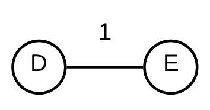

# 2015-16 Exame

## 1

### a

    utlimaPosicao = -5 // Guarda  kms do último cartaz
                    // começa a -5 para ser possível meter um cartaz na posição 0 kms
    custo = 0
    for (int i = 0; i < pos.size(); i++)
        if (pos[i] - ultimaPosicao >= 5)
            //coloca o cartaz nessa posição
            custo += valor[i]
            ultimaPosicao = pos[i]

Este algoritmo tem uma complexidade temporal O(n), em que n é o número de cartazes no vetor pos[].

Não é um algoritmo ótimo, no caso dos vetores pos = {1, 3, 6} e valor = {1, 5, 1} o custo final vai ser 2 (1º cartaz + 3º cartaz), enquanto que o valor máximo possível de obter na cobrança de cartazes seria 5 (apenas 2º cartaz).

### b

Não sei

## 2

### a

A - C - D - F - G = 8 + 1 + 4 + 3 = 16

### b

    //Cada vértice tem um atributo preco que corresponde ao seu preço por 1l de gasolina

    for each v ∈ V
        custo(v) <- infinito
        paht(v) <- nil
    gasolina = 10
    custo(A) = 0
    Q = {} //min-priority queue
    insert(Q, A)
    while (Q != {})
        v <- extract_min(Q)
        for each w ∈ adj(v)
            if gasolina < weight(v, w)
                if custo(w) > custo(v) + 10*preco(w)
                    gasolina += 10
                    custo(w) = custo(v) + 10*preco(w)
                    gasolina -= weight(v, w)
                    path(w) = v
                    if w ∉ Q
                        insert(Q, w)
                    else
                        decrease-key(Q, w)
            else
                if custo(w) > custo(v)
                    custo(w) = custo(v)
                    gasolina -= weight(v, w)
                    path(w) = v
                    if w ∉ Q
                        insert(Q, w)
                    else
                        decrease-key(Q, w)

### c

A - C - D - F - G - C - B - D - B - A - E - F - E - D - G

## 3

### a

Usando o algoritmo de Prim, começa-se por adicionar as arestas com menos peso  e depois vai-se adicionando as arestas que ligam a vértices que não estão na árvore, começando pelos que têm menor valor.

Prints por ordem da evolução da árvore

### b

Não sei nenhuma solução possível.

## 4

### a

É impossível pois o fluxo de F para qualquer outro ponto tem de passar pela aresta A-F e A-F tem fluxo máximo de **10000 uv**. Este é também o fluxo máximo da rede.

Gráfico de fluxo:

### b

O volume máximo da rede continuaria o mesmo, sendo que passaria a ser dividido entre os dois consumidores.

Os dois possíveis gráficos de fluxo (prioridade para D ou prioridade para C):

### c

O volume máximo da rede aumentaria para 30000 uv, sendo que o consumidor D poderia receber um fluxo máximo de 30000 uv (20000 de G e 10000 de A) e o consumidor em C poderia receber um fluxo de até 15000 uv (10000 de A e 5000 de D).

## 5

### a

