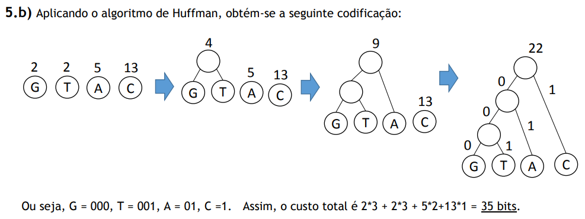

# 2016-17 Exame

## 1

### a
    
    atluraTotal = 0
    alturaPrateleira = 0
    larguraPrateleira = 0
    for (livro ∈ Livros)
        if (L[livro] + larguraPrateleira < LP)
            adiciona livro à prateleira
            larguraPrateleira += L[livro]
            if (A[livro] > alturaPrateleira)
                alturaPrateleira = A[livro]
        else 
            alturaTotal += alturaPrateleira
            passa à próxima prateleira
            alturaPrateleira = A[livro]
            larguraPrateleira = L[livro]
    alturaTotal += alturaPrateleira
    return alturaTotal        

    Neste algortimo a complexidade temporal é O(n), corre todos os livros uma vez.
    Não é um algoritmo perfeito, por exemplo com os livros de alturas 1, 2, 2, tendo todos largura 1 e LP = 2, custa 4 de altura enquanto que o custo ótimo é 3.

### b

WTF [resolução](https://moodle.up.pt/pluginfile.php/116003/mod_label/intro/2017-06-08.ExameCAL_v2_Resolu%C3%A7%C3%A3o.pdf)

## 2

### a

Do ponto da A para o ponto de cima, adicionando o ponto da esquerda de cada vez

|  |A |B |C |D |E |F |G |
|--|--|--|--|--|--|--|--|
|A |0 |1 |3 |- |- |10|- |
|B |0 |1 |2 |8 |6 |10|3 |
|C |0 |1 |2 |8 |5 |10|3 |
|D |0 |1 |2 |8 |5 |9 |3 |
|E |0 |1 |2 |7 |5 |7 |3 |
|F |0 |1 |2 |7 |5 |7 |3 |
|G |0 |1 |2 |7 |5 |7 |3 |

Caminho mais curto de A a F = A - B - C - E - F = 1+1+3+2=7

### b

Para este problema podemos aplicar o algoritmo de Dijkstra com vértice inicial igual a vi e vértice final igual a vk, guardar o caminho mais curto entre esses dois pontos e depois aplicar novamente o algoritmo de Dijsktra mas agora com vértice inicial vk e vértice final vf. 

No final adiciona-se o menor caminho entre estes dois pontos ao primeiro caminho e fica-se com o menor caminho entre o vértice vi e vf que passa por vk.

## 3

### a

Existe apenas um ponto de articulação, o ponto D.

Caso se remova este ponto o grafo fica separado em dois grafos. O mesmo não acontece para mais nenhum ponto do grafo.

### b

Passo 1: Encontrar os vértices que têm grau ímpar (nº de arestas que saem do vértice). Neste caso, d e e.

Passo 2: Encontrar o menor caminho entre os pares de vértices anteriores. d-e com peso 6.

Passo 3: Repetir todas as arestas anteriores no grafo, ficando assim com 2 arestas de valor 6 entre e e d.

Passo 4: Encontrar o emparelhamento perfeito de peso mínimo no novo grafo. (Emparelhar os vértices de grau impar minimizando as distâncias entre si.) Neste caso é e-d.

Passo 5: Remover as arestas que foram adicionadas em 2 e não estão utilizadas em 4. Nenhuma para este exercício.

Passo 5: Encontrar o caminho de Euler mais curto no novo Grafo.

Neste caso: a - c - f - d - g - e - b - d - e - d - a = 2+5+3+2+7+3+5+6+6+7 = 46

## 4

### a

Nas vias que partem de C1 apenas podem passar 3 * 2000 + 3 * 2000 + 2 * 2000 = 14000 < 18000 estimadas. Por isso, a rede construída não é capaz de dar resposta ao número de viagens estimado.

### b

Resolvendo este exercício como um problema de Fluxo, seria melhor explorar a rede com cobrança de portagens no troço que tiver um maior volume horário. O grafo de fluxo máximo seria:

-Fluxo.png)

Assim, a portagem seria mais rentável entre C1 e C4, uma vez que entre C4 e C7 poderia haver 6000 veículos por hora, mas, 2000 poderiam ir para C6 e, depois para C7 e assim, reduzier o número de veículos por hora entre C4 e C7 para 4000.

## 5

### a

Como existem 4 letras diferente, 2², seriam precisos 2 bits para cada letra do gene. Como existem 22 letras no gene serão precisos 22 * 2 = 44 bits para guardar informação sobre o gene.

### b

## 6

Aviso prévio, não sei muito de Ps e NPs.

### a

Este problema pode ser transformado para um problema de decisão, passando a ser: É possível utilizar k ou menos slots de 1 hora sem que estudantes inscritos em vários cursos tenham exames sobrepostos?

### b

Pode ser contruído um grafo em que os vértices são os diferentes cursos, e as arestas representam um ou mais estudantes que tenham 2 cursos. Por exemplo um grafo com os vértices A e B, se existir uma aresta que ligue A a B significa que existe pelo menos um estudante com os dois cursos.

Desta maneira o problema de Coloração de Grafos passa a ser redutível em tempo polinomial para o problema da Marcação dos Exames:

- Conversão de entradas: as entradas do Grafo representante do problema da Marcação de Exames podem ser utilizadas como entradas para o problema da Coloração de Grafos.
- Conversão de saídas: o número de cores que saem do algoritmo de Coloração de Grafos é o mesmo número de slots de 1 hora que podem ser utilizados na Marcação de Exames.
- No problema da Coloração de Grafos, dois vértices adjacentes não podem ter a mesma cor, no problema de Marcação de Exames, utilizando cores em vez de um horário, dois cursos que tenham uma aresta comum não podem ter a mesma horário porque têm, pelo menos, um estudadente em comum, ou seja, dois vértices adjacentes não podem ter a mesma cor.

Como o problema de Coloração de Grafos é um problema NP-completo e é reduzível, em tempo polinomial, para o problema de Marcação de Exames, este último problema também é um problema NP-completo.