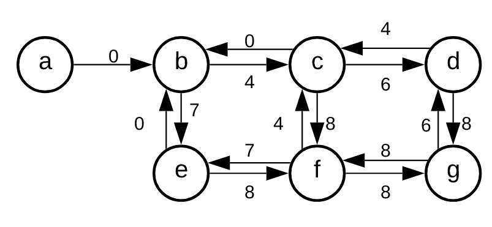
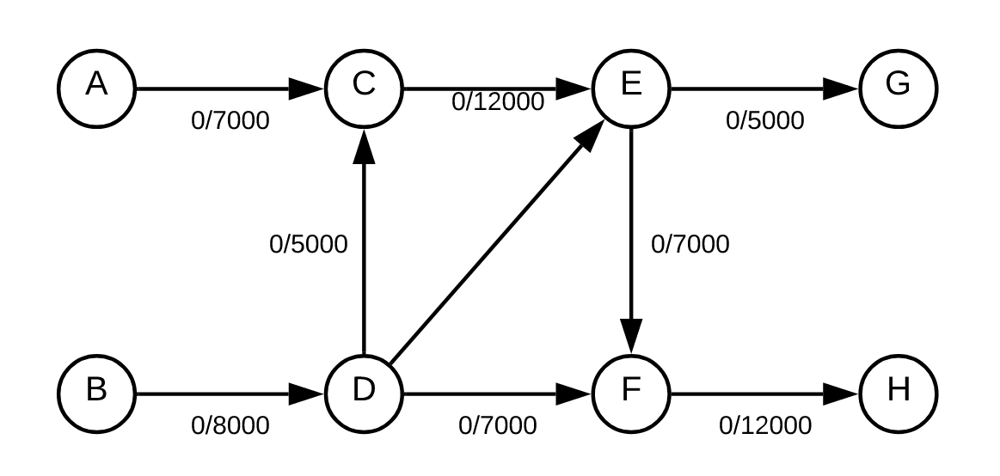
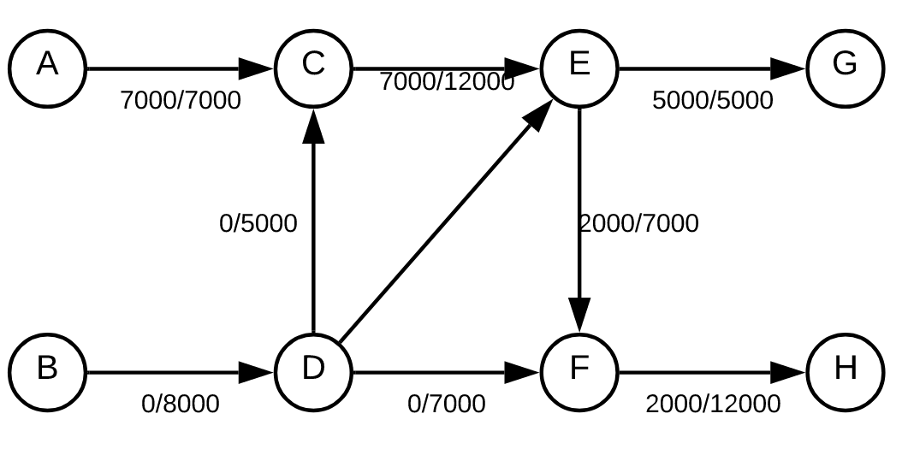
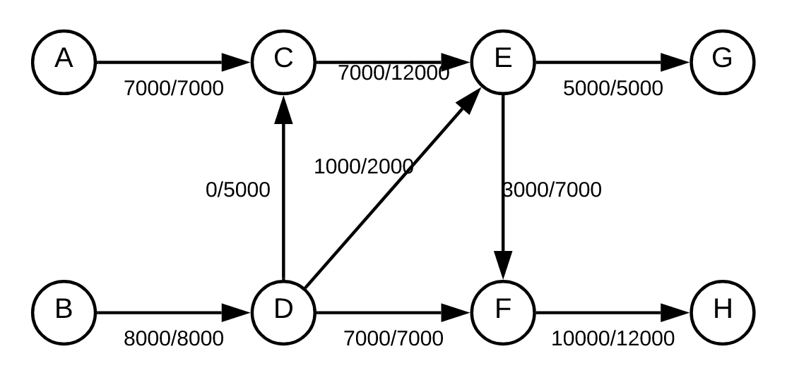

# 2017-18 exame

# Parte prática

## 1

### a

            0, i = n
    m(i) = 
            f(i,j) + m(j), 1 <= i < j <= n (menor resultado para todos os j possíveis)

### b

    for (int i = 0; i < n; i++)
        m[i] = infinito
    m[n] = 0
    for (int i = 0; i < n; i++){
        for (int j = i + 1; j <= n; j++){
            m[i] = min(m[i], f(i,j) + m(j))
        }
    }
    return m[1]

Complexidade temporal - O(n²), corre todos os números em i * todos os números em j.
Complexidade espacial - O(n), m[0] até m[n]

## 2

### a

Este problema pode ser convertido num problema de grafos em que cada quadrícula corresponde a um vértice e o valor de cada quadrícula corresponde ao peso da arestas direcionais que chegam ao vértice correspondente.

Neste caso podemos considerar que existe um vértice adicional para além do tabuleiro com uma aresta para a quadrícula inicial para esta poder ter um valor diferente de 0.

Neste caso não é necessário ter o vértice a pois nos exemplos a quadrícula do canto superior esquerdo é sempre 0.

### b

Os grafos vão ser representados por nome alfabeticamente, da esquerda para a direita e de cima para baixo. A prioridade vai ser aresta da direita, baixo, esquerda, cima.

    dist(A) = 0, path(A) = null
    A -> B, dist(B) = 4, path(B) = A
    A -> E, dist(E) = 7, path(E) = A
    B -> C, dist(C) = 7, path(C) = B
    B -> F, dist(F) = 12, path(F) = B
    E -> F
    E -> I, dist(I) = 9, path(I) = E
    E -> A
    C -> D, dist(D) = 13, path(D) = C
    C -> G, dist(G) = 13, path(G) = C
    C -> B
    I -> J, dist(J) = 12, path(J) = I
    I -> E
    F -> G
    F -> J
    F -> E
    F -> B
    J -> K, dist(K) = 13, path(K) = J
    J -> F
    D -> H, dist(H) = 21, path(H) = D
    D -> C
    G -> H
    G -> K
    G -> F
    G -> C
    K -> L, dist(L) = 21, path(L) = K
    K -> J
    K -> G
    H -> L
    H -> G
    H -> D
    L -> K
    L -> H

### c

Não sei que algoritmo é que é, mas para não deixar em branco:

Um algoritmo de retrocesso, e como o número de vértices possíveis de visitar vai sempre diminuir para metade O(log(n)) mas como se tem de repetir para n possibilidades O(n * log(n)) ????

## 3

### a

Assim, o fluxo máximo é 15000

### b

Como no novo arco não se vai reduzir a capacidade do arco que vem antes deste o fluxo máximo resultante vai ser o mesmo, ou seja, 15000

### c

Nos grafos desenhados na alínea 3.a) o arco D -> C não é utilizado, por isso, não faria diferença se estivesse ou não obstruído, continuando o fluxo máximo a ser 15000.

## 4

### a

É possível o percurso ser o grafo X?

### b

Este problema é verificável em tempo polinomial pelo que faz parte dos problemas NP.

Não estou a ver nenhum problema NP-completo que seja parecido com este.

# Parte teórica

## 1

O(n), pois tem de correr uma vez os números de 0 a n
S(1), pois apenas tem de guardar os valores de f(n - 1), f(n - 2) e fn.

**T(n) = O(n), S(n) = O(1)**

## 2

Merge sort separa o vetor em vetores mais pequenos e organiza-os.

**Divisão e Conquista**

## 3

Verifica uma possível solução, se funcionar aceita, se não funcionar tenta outra.

**alg. de retrocesso**

## 4

Escolhe a hipótese que mais provavelmente será melhor

**alg. ganancioso**

## 5

Como o ciclo é independente da variável m esta é uma **invariante do ciclo**

## 6

Fortemente conexo - A partir de qualquer vértice consegue chegar-se a todos os vértices

Fracamente conexo - Todos os vértices têm arestas e fazem todos parte do mesmo grafo.

**B**

## 7

Numa visita em profundidade escolhe-se uma das arestas do vértice e continua-se sempre nesse caminho até não haver mais aresta para vértices ainda não encontrados.

Na alíne a) isto não acontece pois após o e passa-se para o vértice d.

**a-e-d-g-b-c-f**

## 8

**O((|V|+|E|) * log|V|)**

## 9

**O(|V|³)**

## 10

Arestas da árvore de expansão mínima:
    
    b - f
    f - c
    c - e
    c - d

    1 + 2 + 1 + 3 = 7

**7**

## 11

Para haver emparelhamento os vértice têm de ser unidos 2 a 2, no cas o máximo ficamos com as arestas

    b - c
    e - d

    5 + 14 = 19

**19**

## 12

Um ponto de articulação é um vértice que ao ser removido transforma um grafo em 2. Neste caso os pontos de articulação são, 2, 3 e 5

**3**

## 13

**Ford-Fulkerson**

## 14

Se for um grafo não dirigido precisa que:

-   seja conexo
-   cada vértice ter grau par

Se for dirigido precisa que:

-   seja conexo
-   todos menos 2 vértices tenham grau par e tenham o mesmo grau de entrada e saída

**B**

## 15

**O(|P| + |T|)**

## 16

Passando de "MALTA" para "ALTURA"

1.  Remover M
2.  Adicionar U
3.  Adicionar R

**3**

## 17

W = 01
E = 00
L = 1

1 * 2 + 1 * 2 + 2 * 1 = 6

**6**

## 18

**verificáveis**

## 19

**caixeiro viajante**

## 20

**carteiro chinês**

