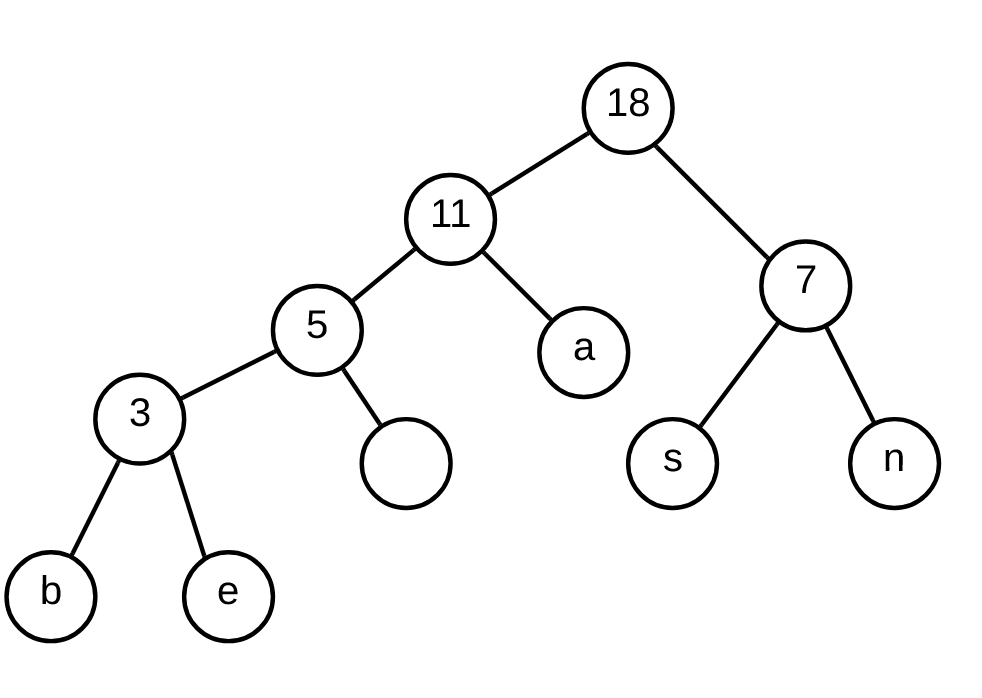

# 2018-19 exame

# Parte prática

## 1

RIP 4 valores

## 2

### a

    A - D = 10
    A - E = 10
    B - D = 5
    B - F = 5
    C - D = 10
    C - E = 5
    C - F = 5

    Saídas:
        A - 15 + 5 = 20
        B - 5 + 5 = 10
        C - 10 + 5 + 5 = 20
    Chegadas:
        D - 10 + 5 + 10 = 25
        E - 10 + 5 = 15
        F - 5 + 5 = 10

Fluxo máximo = 20 + 20 + 10 = 25 + 15 + 10 = 50

### b

D recebe 25 limite 25
E recebe 15 limite 20
F recebe 10 limite 20

Todos os destinos são abastecidos, mas tanto E como F não são abastecidos completamente, para colmatar esta falha seria preciso que houvesse mais transportes dos depósitos para os destinos.

### c

Usando o algoritmo de Dijkstra

    dist(A) = 0, paht(A) = null
    A -> B, dist(B) = 5, path(B) = A
    A -> E, dist(E) = 10, path(E) = A
    A -> D, dist(D) = 6, path(D) = A
    B -> C, dist(C) = 13, path(C) = B
    B -> F, dist(F) = 26, path(F) = B
    D -> H, dist(H) = 18, path(H) = D
    D -> A
    E -> F, dist(F) = 13, path(F) = E
    E -> H, dist(H) = 14, path(H) = E
    E -> A
    C -> F
    C -> B
    F -> G, dist(G) = 20, path(G) = F
    F -> I, dist(I) = 17, path(I) = F
    F -> E
    H -> I
    H -> E
    H -> D
    I -> G
    I -> H
    I -> F
    G -> I
    G -> F

O caminho mais curto é AEFG, de tamanho 20.

## 3

### a

Existem 6 caracteres diferentes (a, b, n, s, e, espaço), para os representar são precisos 3 bits.

### b

    a - 6
    b - 1
    n - 4
    s - 3
    e - 2
    espaço - 2

    a = 01
    b = 0000
    n = 11
    s = 10
    e = 0001
    espaço = 001

### c

Codificação constante - 3 * 18 = 54 bits

Codificação variável - 6 * 2 + 1 * 4 + 4 * 2 + 3 * 2 + 2 * 4 + 3 * 2 = 44 bits

Codificação UTF-16 = 16 * 18 = 288 bits

## 4

### a

Se contactarmos as personalidades presentes na lista X resulta numa campanha bem sucedida?

### b

Este problema é um problema parecido com o problema da cobertura de vértices, podendo ser reduzido a este.

-   Redução de entradas: As celebridades são os vértices e as amizades são as arestas que ligam os vértices.
-   Redução de saídas: As saídas da cobertura de vértices podem ser as saídas deste problema, em que o grafo com os vértices mínimos que tem todas as arestas, é o grafo mínimo das celebridades em que este grafo tem todos as celebridades necessários para ter todas as amizades.

Como o problema deste exercício pode ser reduzido em tempo polinomial para um problema NP-completo, este problema é, também, um problema NP-completo, pelo que não tem uma solução em eficiente.

# Parte teórica

## 1

T(n, k) = O(k * (n - k)) pois tem de correr 2 vezes todos os números, uma em n e outra em k, sendo que a vez em n, n tem sempre de ser maior que k. (Sérias dúvidas nesta parte).

S(n) = O(1) pois apenas tem de guardar 3 valores, dois para a fórmula e o atual.

**T(n) = O(k + (n - k)), S(n, k) = O(1)

## 2

**divisão e conquista**

## 3

**retrocesso**

## 4

**disivão e conquista**

## 5

**B**