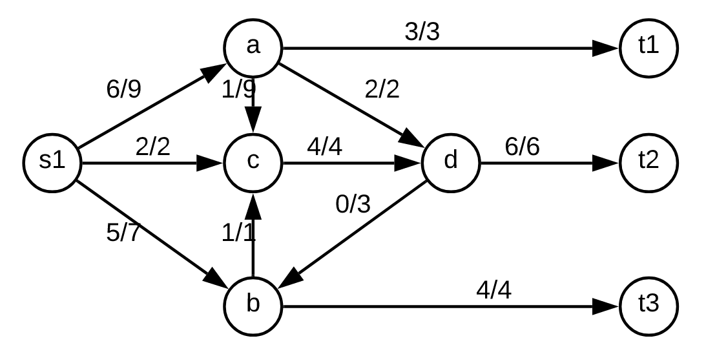
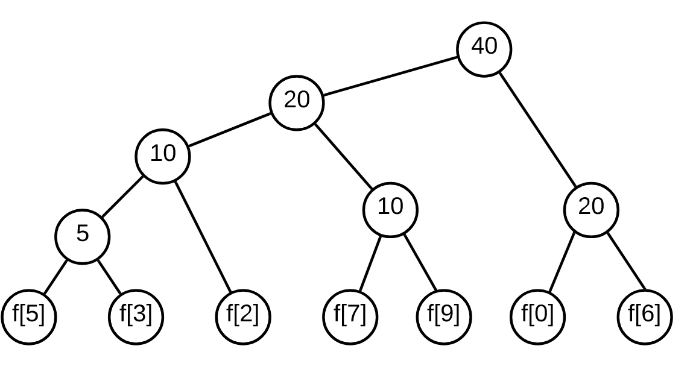

# 2015-16 recurso

## 1

### a

    //inicial e final são inteiros que representam os dias
    //no caso do final ser o número seguinte a inicial só temos o dia de compra e o de venda
    função (inicial, final):
        lucro = 1000*preco[final] - 1000*preco[inicial]
        if (final = inicial + 1)
            return lucro
        return max(lucro, funcao(inicial + 1, final), função(inicial, final - 1))

Esta resolução tem como base calcular o lucro usando apenas 2 dias, no caso de termos mais de 2 dias, dividimos em 3 casos, comprar no primeiro dia e vender no último ou não comprar no primeiro dia e não vender no último dia.

Esta função vai ser chamada n * n vezes (todos os dias iniciais possíveis * todos os dias desde o novo inicial até ao final, sendo que não podem ser o mesmo) logo tem uma complexidade temporal O(n*log(n)).

### b

**Eu acho que esta resolução é brute-force e não programação dinâmica mas não sei fazer melhor**

    //Lucro[i][j] é o lucro comprando no dia i e vendendo no dia j
    lucro = 0
    for (int i = 0, i < n - 1; i++){
        for (int j = i + 1; j < n; j++)
            lucro = max(lucro, 1000*preco[j] - 1000*preco[i])
    }

Esta resolução corre todos as possibilidades de dias iniciais e finais e guarda o melhor valor.

complexidade temporal O(n * n), corre uma vez todos os dias como iniciais e corre os dias finais possíveis.

## 2

### a

Usando as arestas com ordem no sentido horário a partir das 12 horas.

O primeiro vértice a ser verificado é o que tiver menor distância, assume-se que todos os vértices começam com dist(V) = infinito

    dist(A) = 0, path(A) = null
    A -> B, dist(B) = 7, path(B) = A
    A -> D, dist(D) = 2, path(D) = A
    D -> B, dist(B) = 5, path(B) = D
    D -> C, dist(C) = 10, path(C) = D
    D -> E, dist(E) = 6, path(E) = D
    B -> C, dist(C) = 7, path(C) = B
    E -> F, dist(F) = 14, path(F) = E
    C -> F, dist(F) = 12, path(F) = C
    C -> E

As arestas que não têm valor de dist nem de path não alteram nenhum destes valores.

### b

Mesma lógica do exercício anterior mas em vez de dist(V) vou usar custo(V).

    custo(A) = 0, path(A) = null
    A -> B, custo(B) = 10, path(B) = A
    A -> D, custo(D) = 10, path(D) = A
    B -> C, custo(C) = 30, path(C) = B
    D -> B
    D -> C
    D -> E, custo(E) = 65, path(E) = D
    C -> F, custo(F) = 60, paht(F) = C
    C -> E, custo(E) = 60, path(E) = C
    E -> F

### c

Não, ordenar por ordem crescente da distância à partida não é por si só uma ordenação topológica, se um determinado vértice tiver 2 arestas, uma para um vértice que está mais próximo de O e um outro vértice que está mais longe, esse vértice vai ter uma aresta para cada sentido do grafo e, por isso, o grafo não vai estar ordenado topologicamente.

## 3

### a

Imaginando um árvore de expansão mínima entre as 6 cidades, nunca compensa passar pelas outras cidade pois têm custos elevados para juntar quaisquer 2 cidades em que a empresa se encontra. Ficamos com as arestas:

-   D - A
-   F - A
-   A - B
-   B - E
-   F - C

Somando os valores delas todas, 4 + 7 + 9 + 12 + 16 = 48.

### b

Esta afirmação é verdadeira pois o vértice C tem apenas 2 arestas, uma com F e outra com D. Como, a aresta que termina em D é a aresta com maior valor de todo o grafo só poderia fazer parte da árvore de expansão mínima se não houvesse outra aresta em C, como existe a aresta C - F esta vai sempre fazer parte da árvore de expansão mínima, em detrimento da outra.

### c

Falso, numa árvore de expansão mínima o objetivo é ter o mínimo custo possível para ligar todos os vértices, mas ao fazer isto podem-se perder caminhos mínimos entre dois pontos, por exemplo, na árvore de expansão mínima do exercício 3.a), o caminho entre D e C é D - A - F - A, com um custo de 27, enquanto que o menor caminho possível no grafo original seria D - C com um custo de 19.

## 4

### a

Assim, o fluxo máximo é 13 e, para cada canal, a = 6, b = 5, c = 4, d = 6.

### b

Não sei fazer o corte mínimo.

### c

Sem esse canal, o fluxo a sair de a vai ser menor, vai ser 6 - 2 = 4 e, por isso, o fluxo total, vai passar a 13 - 2 = 11.

## 5

### a

Para 10 caracteres são necessários 4 bits (2³ = 8 e 2⁴ = 16), 4 * (10+5+3+2+10+5+5) = 160

### b

Com tamanho variável,

    f[0] = 1
    f[6] = 01
    f[2] = 001
    f[7] = 0001
    f[9] = 00001
    f[3] = 000001
    f[5] = 000000

    10 * 1 + 10 * 2 + 5 * 3 + 5 * 4 + 5 * 5 + 3 * 6 + 2 * 6 = 120 bits

### c

Considerando o alfabeto codificado na alínea anterior:

    1 = f[0]
    0001 = f[7]
    001 = f[2]
    0001 = f[7]
    1 = f[0]
    01 = f[6]

A sequência de caracteres seria f[0] f[7] f[2] f[7] f[0] f[6].
    

## 6

### a

É possível realizar a monitorização de todas as ligações com k novos routers?

### b

Este problema é um problema que pode ser verificável em tempo polinomial, por isso, é um problema NP.

Este problema pode ser convertido para o problema da Cobertura de Vértices, sendo precisas estas conversões:

-   Conversão de entradas - pode-se utilizar o mesmo grafo para os dois problemas;
-   Conversão de saídas - a saída do problema da Cobertura de vértices pode ser a mesma do problema da empresa.

Como as entradas e saídas podem ser convertidas em tempo polinomial para as entradas e saídas do outro problema e esse problema é NP-completo, então o problema do exercício também é NP-completo, ou seja, é verificável em tempo polinomial mas não é resolvido em tempo polinomial, pelo que não existe uma solução eficiente. 

