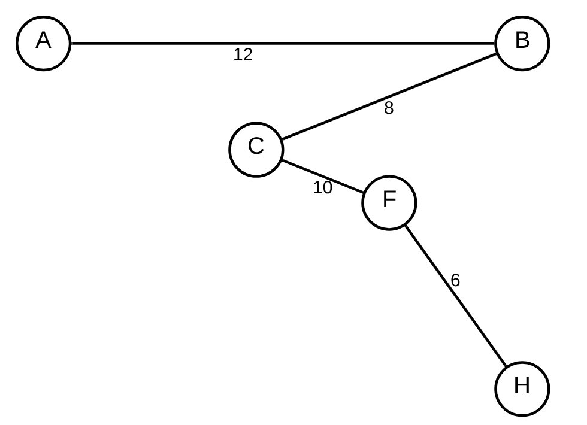
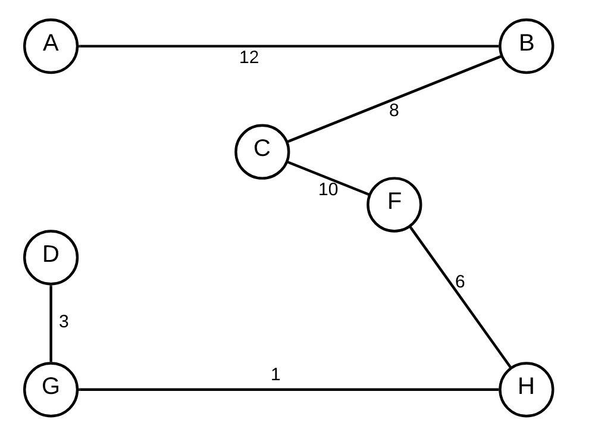
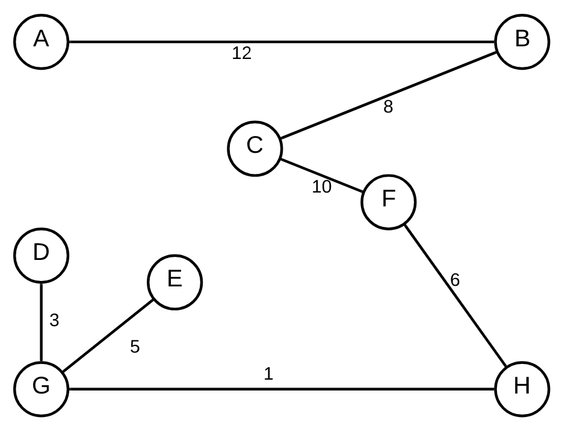

# 2016-17 recurso

## 1

### a

    result // subsequências finais
    for (each n ∈ S)
        number = n
        temp = {}
            for (each x ∈ S)
                insert(temp, x)
                if (x == n)
                    break;
                if (x == S[último])
                    temp = {n}
            insert(result, temp)
    
Neste caso, a minha solução vai separar em subsequências que acabam sempre na primeira repetição do número que começa essa mesma sequência, isto não é ótimo, por exemplo, na sequência {1,1,1} o resultado vai ser 2, {{1,1}, {1}}.

### b

RIP 2.5 valores

## 2

### a

No algoritmo de Prim adiciona-se sempre a aresta com menos peso em que 1 dos vértices pertence ao novo grafo e outro ainda não

### b

Como G - H tem o menor peso possível, esta seria sempre a primeira aresta, por isso, a aresta C - E seria adicionada depois de adicionar E mas antes de adicionar a aresta F - C, pelo que teria de ser um valor menir que 10, ou seja, 0 < w <= 9.

## 3

### a

Usando as arestas com ordem no sentido horário a partir das 12 horas.

O primeiro vértice a ser verificado é o que tiver menor distância, assume-se que todos os vértices começam com dist(V) = infinito

    dist(A) = 0, path(A) = null
    A -> B, dist(B) = 12, path(B) = A
    A -> C, dist(C) = 16, path(C) = A
    A -> D, dist(D) = 14, path(D) = A
    B -> H, dist(H) = 25, path(H) = B
    B -> F, dist(F) = 31, path(F) = B
    B -> C
    B -> A
    D -> C
    D -> E, dist(E) = 25, path(E) = D
    D -> G, dist(G) = 17, path(G) = D
    D -> A
    C -> B
    C -> F, dist(F) = 26, path(F) = C
    C -> D
    C -> A
    G -> E, dist(E) = 22, path(E) = G
    G -> H, dist(H) = 18, path(H) = G
    G -> D
    H -> B
    H -> G
    H -> E
    H -> F, dist(F) = 24, path(F) = H
    F -> B
    F -> H
    F -> E
    F -> C
    E -> F
    E -> H
    E -> G
    E -> D

Espero não me ter escapado nenhuma aresta. As arestas que depois não têm valor de dist nem de path significa que não alteram nenhum destes valores.

### b

    for each v ∈ v
        custo(v) = infinito
        path(v) = null
    custo(A) = 0
    Q = {} //min-priority-queue
    insert(Q, A)
    while(Q != {})
        v = extract-min(Q)
        for each w ∈ adj(v)
            if (custo(w) > custo(v) + 1)
                custo(w) = custo(v) + 1
                path(w) = v
                if w ∈ Q
                    decrease-key(Q, w)
                else
                    insert(q, w)

Usando o algoritmo de Dijkstra facilmente se obtém o menor custo entre os dois pontos. Neste caso, o algortimo tem uma complexidade temporal O( (|V| + |E|) * log|V| ).

## 4

### a

O fluxo máximo é a quantidade máxima que sai de H, pois a partir de aí os dispersores começam a libertar água e só parte dela é que continua nos tubos.

Assim, o limite do fluxo é 10.

### b

Admitindo que o aspersor primeiro deixa passar água para a tubulação e só depois liberta a água, existe um fluxo de 10 litros/hora na tubulação E -> H.

## 5

### a

Alterar o OPTX para ser igual ao XPTO
1.  Remoção do primeiro A; (AGGACACCCCA)
2.  Inserção do T na posição 4; (AGGTACACCCCA)
3.  Inserção do T na posição 7; (AGGTACTACCCCA)

Logo, a distância evolutiva entre os dois genes tem valor 3.

### b

|0|1|2|3|4|
|-|-|-|-|-|
|G|T|G|C|C|
|0|0|1|0|0|

## 6

### a

O grafo G é um clique de G?

### b

#### Existe uma grande probabilidade disto estar errado mas dar alguns pontos na mesma

Este algoritmo é o complementar do algoritmo do Conjunto Independente, pelo que pode ser transformado no mesmo.

-   Conversão de entradas: A entrada do algoritmo do Conjunto Indepedente seria o mesmo grafo do problema.
-   Conversão de saídas: As saídas do algoritmo do Conjunto Independente será um grafo composto pelos vértices que não partilham arestas. Isto é convertível para a saída do problema em tempo polinomial fazendo o complementar desta saída.

Como a conversão de entradas e de saídas é feita em tempo polinomial entre os dois problemas e, o algoritmo do Conjunto Independente é um problema da classe NP-completo, então, o problema da questão também é um problema da calsse NP-completo.
